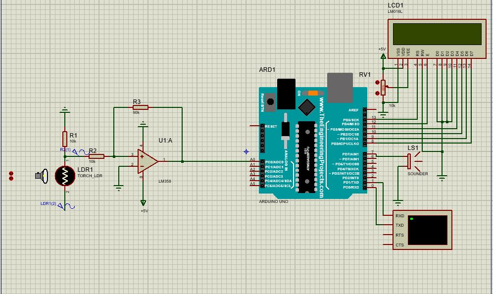

# Light Intensity Detection System for Security Alarm

## Abstract

This project presents the design and simulation of a light intensity sensor detection system for an alarm using MATLAB Simulink and Proteus. The system employs signal processing techniques such as amplification, filtering, and noise removal to enhance the detection of changes in light intensity. The report outlines the design process, system architecture, implementation details, and simulation results.

## Table of Contents

- [Introduction](#introduction)
- [Methodology](#methodology)
  - [Filter Specifications](#filter-specifications)
  - [Designing the Filter in MATLAB FDA Tool](#designing-the-filter-in-matlab-fda-tool)
  - [Simulating the System in Proteus](#simulating-the-system-in-proteus)
- [Circuit Setup](#circuit-setup)
  - [Components Required](#components-required)
  - [LDR and Voltage Divider](#1-ldr-and-voltage-divider)
  - [Amplification Stage](#2-amplification-stage)
  - [Connect the Arduino](#3-connect-the-arduino)
  - [Power the Circuit](#4-power-the-circuit)
  - [Updated Circuit Setup](#updated-circuit-setup)
    - [LCD Connection](#lcd-connection)
    - [Buzzer Connection](#buzzer-connection)
- [Software Implementation](#software-implementation)
  - [Filter Implementation](#filter-implementation)
- [Simulation](#simulation)
- [Limitations and Future Work](#limitations-and-future-work)
- [Conclusion](#conclusion)
- [Keywords](#keywords)
- [License](#license)
- [Acknowledgments](#acknowledgments)

## Introduction

Light intensity sensors have emerged as indispensable components in a wide array of applications, with their significance extending to critical domains such as security systems. The ever-increasing reliance on technology to safeguard lives and property necessitates continuous advancements in the field of sensor technology. This project embarks on the design and implementation of a robust Light Intensity Detection System for Security Alarms, leveraging the capabilities of MATLAB Simulink and Proteus.

The proposed system aims to surpass conventional light intensity sensors by incorporating advanced signal processing techniques within the MATLAB Simulink environment. This integration enhances the overall reliability, accuracy, and sensitivity of the sensor, enabling it to detect subtle alterations in light levels that might indicate potential security threats. By leveraging the computational power of MATLAB Simulink and the simulation capabilities of Proteus, the project seeks to optimize the sensor's performance, ensuring a swift and precise response to varying light conditions.

## Methodology

### Filter Specifications

Based on the application requirements, a low-pass filter would be suitable to smooth out the light sensor readings while maintaining responsiveness. Here are the recommended filter specifications:

- **Filter Type**: Butterworth low-pass filter
- **Filter Order**: 2nd order (a good balance between performance and complexity)
- **Cutoff Frequency**: 1-5 Hz (to allow slow changes in light intensity while filtering out high-frequency noise)
- **Sampling Frequency**: 100 Hz (assuming a reasonable sampling rate for the light sensor)
- **Passband Ripple**: 1 dB (for a smooth response)
- **Stopband Attenuation**: 20 dB (to attenuate high-frequency noise)

### Designing the Filter in MATLAB FDA Tool

1. **Open MATLAB** and launch the FDA Tool by typing `fdatool` in the command window.
2. **Select "Lowpass Filter"** as the filter type.
3. **Set the Design Method to "Butterworth"**.
4. **Set the Filter Order to 2**.
5. **Set the Cutoff Frequency** based on your requirements (based on our ldr specs we used 3.18 - 5 Hz).
6. **Set the Sampling Frequency** to 100 Hz.
7. **Click "Design Filter"** to generate the filter coefficients.
8. **Export the filter coefficients** to a C header file or copy them directly into your Proteus code.

### Simulating the System in Proteus

1. **Set up the light sensor circuit** in Proteus, including the LDR, amplifier, and microcontroller.
2. **Implement the filter** using the coefficients obtained from the MATLAB FDA Tool.
3. **Generate a light intensity signal** to simulate changes in the environment.
4. **Add noise** to the light intensity signal to test the filter's performance.
5. **Monitor the filtered output** and compare it to the original signal to assess the filter's effectiveness.
6. **Adjust the filter parameters** (e.g., cutoff frequency, order) as needed to optimize the performance.
7. **Set up the alarm threshold** based on the filtered light intensity signal.
8. **Verify the alarm triggering** when the light intensity exceeds the specified threshold.

## Circuit Setup

### Components Required

- **Light Dependent Resistor (LDR)**
- **Resistors**: 
  - 10 kΩ
  - 90 kΩ
- **Capacitors**: 
  - 3.18 mF
- **Operational Amplifier**: 
  - LM358 (or equivalent)
- **Arduino Uno**
- **Buzzer**
- **Liquid Crystal Display (LCD)**
- **Connecting Wires**
- **Breadboard**
- **Power Supply** (if needed)

### 1. LDR and Voltage Divider

- Connect one terminal of the LDR to **5V**.
- Connect the other terminal of the LDR to a **10 kΩ resistor**.
- Connect the other end of the resistor to **GND**.
- The junction between the LDR and the resistor provides the analog signal for the Arduino.

### 2. Amplification Stage

- Use an operational amplifier (e.g., LM358) in a **non-inverting configuration**.
- Connect the voltage divider output (from the LDR) to the **non-inverting input** of the op-amp.
- Configure the gain using:
  - R_f = 90 \, kΩ 
  - R_{in} = 10 \, kΩ 

### 3. Connect the Arduino

- Connect the output of the op-amp to an **analog input pin** on the Arduino (e.g., **A0**).
- Connect a **buzzer** to a **digital output pin** on the Arduino (e.g., **D9**).

### 4. Power the Circuit

- Provide power to the Arduino and the operational amplifier as required.

### Updated Circuit Setup

#### LCD Connection

- **RS (Register Select)**: Connect to Arduino pin **13**
- **EN (Enable)**: Connect to Arduino pin **12**
- **D4**: Connect to Arduino pin **11**
- **D5**: Connect to Arduino pin **10**
- **D6**: Connect to Arduino pin **9**
- **D7**: Connect to Arduino pin **8**
- **V0 (Contrast Pin)**: Connect to the wiper (middle pin) of a **10 kΩ potentiometer**; the other two pins go to **5V** and **GND**.

#### Buzzer Connection

- **Positive Terminal**: Connect to a digital pin on the Arduino (e.g., **D7**).
- **Negative Terminal**: Connect to the **GND** pin on the Arduino.

## Software Implementation

The software implementation involves using the Arduino IDE to program the Arduino Uno. The code integrates the following functionalities:

- **Reading the analog signal** from the LDR.
- **Filtering the signal** using a cascade of biquad filters to reduce noise and improve accuracy.
- **Displaying the light intensity** on an LCD.
- **Triggering a buzzer** when the light intensity exceeds a predefined threshold.

### Filter Implementation

The filtering process uses coefficients defined in the `b`, `a`, and `g` arrays, which are derived from a MATLAB filter design tool. The biquad filter structure is implemented to smooth the readings from the LDR, ensuring that the system can reliably detect changes in light intensity.

## Simulation

The system can be simulated in the Proteus environment. The following steps outline how to set up the simulation:

1. Create the circuit as described in the circuit setup section.
2. Use a signal generator to simulate noise on the LDR signal.
3. Implement the filtering circuit using operational amplifiers.
4. Monitor the output using virtual instruments like oscilloscopes to verify the effectiveness of the filtering.

## Proteus System Setup

Below is the setup of the Light Intensity Detection System in the Proteus environment:

## Limitations and Future Work

This project acknowledges several limitations, including:

- The assumption of a simplified environment for testing.
- Manual setting of thresholds for triggering the alarm.
- Challenges in tuning parameters for optimal performance.

Future work could involve:

- Automating the threshold setting based on environmental conditions.
- Enhancing the filtering techniques to adapt to varying noise levels.
- Expanding the system to include additional sensors for comprehensive security monitoring.

## Conclusion

The Light Intensity Detection System for Security Alarm represents a significant advancement in integrating signal processing techniques for enhanced accuracy in security sensor applications. The project demonstrates the potential for using Arduino, MATLAB, and signal processing to create reliable and responsive security systems.

## Keywords

Signal Processing, Light Intensity Detector, Arduino, MATLAB, Simulation, Amplification, Filtering, Security Alarm.

## License

This project is licensed under the MIT License - see the [LICENSE](LICENSE) file for details.

## Acknowledgments

- Special thanks to the contributors and resources that helped in the development of this project.
- MATLAB and Proteus documentation for providing valuable insights during the design and simulation phases.
